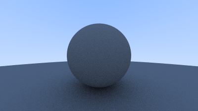
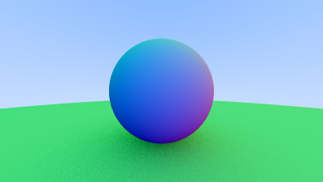
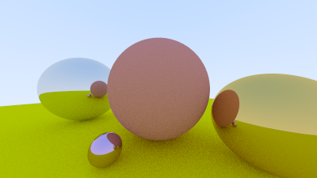
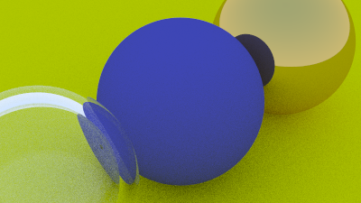

# RAY TRACER
what is it

## Operation
### Execution
Use the command `make run` to complie all necessary files and execute. Outputs the result into image.ppm in the root folder.

Use the command `make clean` to delete all executeables, object files and the image named "image.ppm" in the root from previous execution.

### Camera/Image manipulation
(Make sure when changing camera constants to execute `make clean` before `make run`)

The following is a list of modifiable constants within the file *camera.h*

* Samples per pixel
* Max depth
* Vfov
* Look from
* Look at
* Vup
* Defocus angle
* Focus distance

Within *main.c* the image width can be modified.

### Adding objects

## Examples

  

### diffuse surfaces

  
  

### metal surfaces

  
  

### glass surfaces

  

## Retrospective
what did i learn here

not the right language for this. for example problems with materials
the material struct has values in there that arent relevant to all materials

i need to learn about headers, how to prevent circular dependencies needing
forward declarations