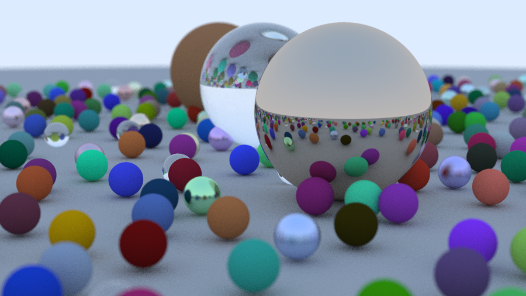

# test title

not the right language for this. for example problems with materials
the material struct has values in there that arent relevant to all materials

i need to learn about headers, how to prevent circular dependencies needing
forward declarations

  

  

