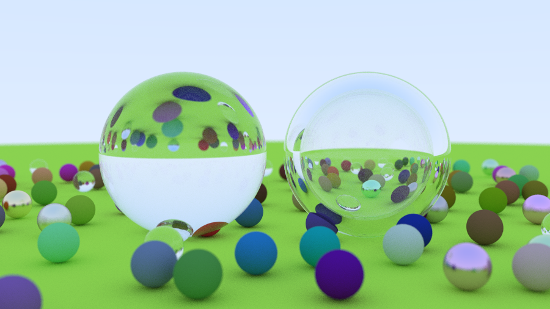
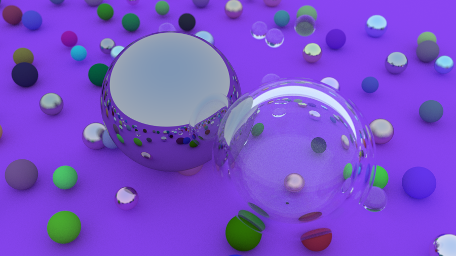

# Ray Tracer
This is a basic ray tracing engine written in C, using indirect lighting and simulating several different surfaces types for spheres.

## Operation
### Execution
Use the command `make run` to complie all necessary files and execute. Outputs the result into image.ppm in the root folder.

Use the command `make clean` to delete all executeables, object files and the image named "image.ppm" in the root from previous execution.

### Camera/Image manipulation
(Make sure when changing camera constants to execute `make clean` before `make run`)

The following is a list of modifiable constants within the file *camera.h*:

* SAMPLES_PER_PIXEL - More samples produces more accurate image. Indicates how many rays will be sent for each pixel. Added for antialiasing.
* MAX_DEPTH - Higher depth produces more accurate image. Indicates maximum number of ray bounces in a scene .
* VFOV - Field of view.
* LOOK_FROM - Point which the camera looks from.
* LOOK_AT - Point which the camera looks at.
* FOCUS_DIST - Distance at which the camera is perfectly focused.

Within *main.c* the image width can be modified.

### Adding objects
Within *main.c* objects can be added to *sphere_list* to appear in the scene.

Each object requires a material to create. These can be assigned to the type `material_t` and initialised using `lamb_surface_init(vec3_t albedo)`, `metal_surface_init(vec3_t albedo, double fuzz)` or `dielectric_surface_init(double ir)`.

The following is a list of addable object types:

* Diffuse sphere - A matte sphere, utilises the lamb_surface material type.
* Metal sphere - A reflective sphere, whose "fuzz" can be modified, utilises the metal_surface material type.
* Glass sphere - A reflective sphere that refracts what it sees upside down the desired amount, utilises the dielectric_surface material type.

To add a sphere to `sphere_list` use `sphere_list.spheres[list_index] = sphere`

N.B. remember to set the number of spheres you've added or it will cause issues.

## Examples

  
  
  

## Retrospective
Upon reflection it is evident that C was not the right language for this, or else there might have been a better approach using this language. An object oriented approach would have been much cleaner and more consise as rays, vectors and so on work better as objects. Furthermore, I would've benefitted greatly from object oriented polymorphism when it came to the materials, as the material struct has redundant variables for some materials. Also, manipulating vectors using my approach in C was very cumbersome.

Along with this I ran into an issue multiple times that I was unprepared for and unfamiliar with, circular dependency with file headers which required forward declaration and some trickery to get around. I feel this was a bad approach and in the future should carefully evaluate design beforehand to prevent this.

It may be worth, later on, creating an easier way to facilitate adding and remove objects from the world. Maybe as a future project I can add this to an app, or to a portfolio further on. Additionally, later on, I may wish to create this to also accept other forms, such as cubes or other shapes.

## Notes
Thankyou Peter Shirley, Trevor David Black and Steve Hollasch for your excellent tutorial in the book *Ray Tracing in One Weekend*.
